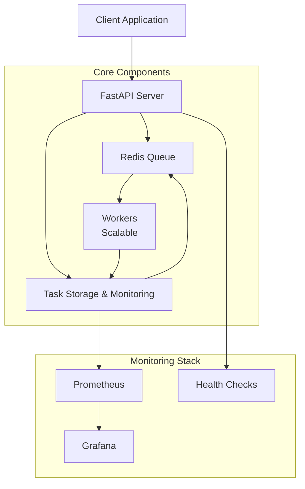

# Distributed Task Queue

A high-performance, scalable distributed task queue system built with FastAPI, Redis, and Docker. Features priority-based task scheduling, fault tolerance, back pressure control, and comprehensive monitoring.

## Features

- **Distributed Architecture**: Redis-backed task queue with multiple worker nodes
- **Priority Scheduling**: Support for HIGH, MEDIUM, and LOW priority task execution
- **Fault Tolerance**: Automatic retry mechanisms, circuit breaker pattern, and dead letter queue
- **Back Pressure Control**: Adaptive throttling based on system load and queue size
- **Monitoring**: Prometheus metrics with Grafana dashboards for real-time insights
- **Health Checks**: Built-in health endpoints for service monitoring
- **Worker Auto-scaling**: Dynamic worker scaling capabilities

## Architecture



## Quick Start

### Using Docker Compose (Recommended)

1. **Clone and start the system:**
   ```bash
   git clone https://github.com/rolanbadrislamov/distributed-task-queue
   cd distributed-task-queue
   docker-compose up -d
   ```

2. **Scale workers (optional):**
   ```bash
   docker-compose up -d --scale worker=5
   ```

3. **Access services:**
   - API: http://localhost:8000
   - Prometheus: http://localhost:9090
   - Grafana: http://localhost:3000 (admin/admin credentials)

### Manual Setup

1. **Install dependencies:**
   ```bash
   pip install -r requirements.txt
   ```

2. **Start Redis:**
   ```bash
   redis-server
   ```

3. **Run API server:**
   ```bash
   uvicorn app.main:app --host 0.0.0.0 --port 8000
   ```

4. **Run workers:**
   ```bash
   python -m app.workers.worker
   ```

## API Usage

### Submit a Task
```bash
curl -X POST "http://localhost:8000/tasks/" \
     -H "Content-Type: application/json" \
     -d '{
       "task_type": "fibonacci",
       "payload": {"n": 30},
       "priority": 2,
       "max_retries": 3
     }'
```

### Check Task Status
```bash
curl "http://localhost:8000/tasks/{task_id}"
```

### Queue Statistics
```bash
curl "http://localhost:8000/tasks/"
```

## Task Types

The system supports three built-in task types:

- **fibonacci**: Calculate Fibonacci numbers
- **matrix_multiply**: Matrix multiplication operations  
- **sleep**: Simulate processing time

Add custom handlers in `app/workers/task_handlers.py`.

## Monitoring

### Metrics Available
- Queue size and processing rates
- Worker CPU/memory usage
- Task completion/failure rates
- Dead letter queue statistics
- Active worker count

### Endpoints
- `/metrics` - Prometheus metrics
- `/health` - Health check status

## Configuration

### Environment Variables
- `REDIS_HOST`: Redis server host (default: redis)
- `REDIS_PORT`: Redis server port (default: 6379)
- `WORKER_ID`: Unique worker identifier
- `WORKERS_COUNT`: Number of worker processes

### Docker Compose Scaling
```bash
# Scale to 8 workers
docker-compose up -d --scale worker=8

# View running services
docker-compose ps
```

## Fault Tolerance

- **Retry Logic**: Failed tasks automatically retry with exponential backoff
- **Dead Letter Queue**: Permanently failed tasks for manual inspection
- **Circuit Breaker**: Prevents cascade failures in overloaded systems
- **Graceful Shutdown**: Workers complete current tasks before stopping

## Performance Testing

Run included experiments to test system capabilities:

```bash
# Basic load test
python experiments/baseline_experiment.py

# High load test
python experiments/high_load_experiment.py

# Stress test
python experiments/stress_test_experiment.py

# Worker scaling analysis
python experiments/worker_scaling_experiment.py

# Fault tolerance testing
python experiments/fault_tolerance_experiment.py

# Priority scheduling verification
python experiments/task_priority_experiment.py
```

## Development

### Project Structure
```
app/
├── api/           # FastAPI endpoints
├── core/          # Core queue and fault tolerance logic
├── models/        # Pydantic data models
└── workers/       # Worker processes and task handlers

experiments/       # Performance and fault tolerance tests
monitoring/        # Grafana dashboards and configurations
```

### Adding New Task Types

1. Create handler in `app/workers/task_handlers.py`:
   ```python
   async def custom_handler(payload):
       # Your task logic here
       return result
   ```

2. Register in worker startup:
   ```python
   worker.register_task_handler('custom_task', custom_handler)
   ```

## License

MIT License - see LICENSE file for details.
